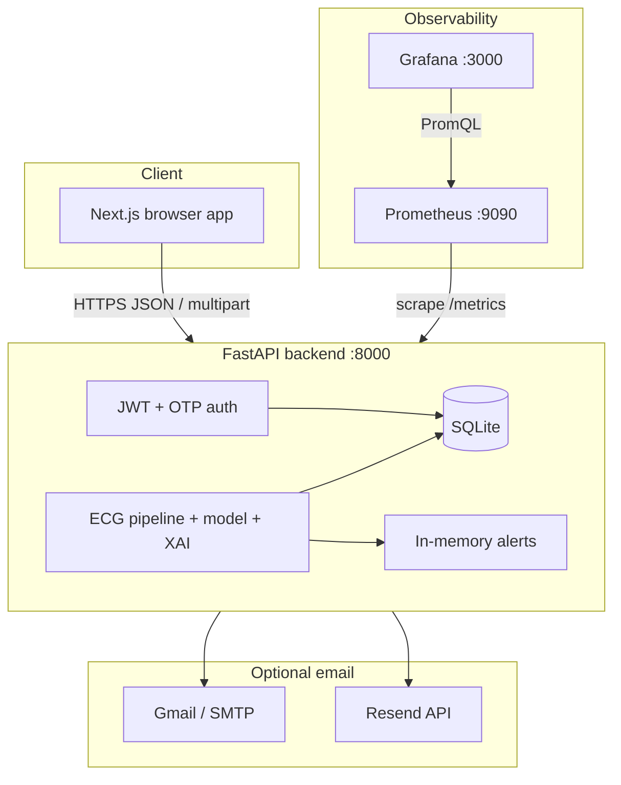

<div align="center">

# CardioSense

**AI-assisted ECG analysis for acute myocardial infarction (AMI) risk and revascularization triage — with explainability, auth, and observability.**

[](https://fastapi.tiangolo.com/)
[](https://nextjs.org/)
[](https://pytorch.org/)
[](https://prometheus.io/)
[](https://grafana.com/)
[]()

*Final-year project · portfolio showcase · technical demo*

</div>

---

## ⚠️ Clinical disclaimer

**CardioSense is an academic and research prototype.** It is **not** a medical device, **not** FDA/CE cleared, and **must not** be used for real clinical diagnosis, treatment decisions, or emergency care. Model outputs are **decision support illustrations only**. Always follow institutional protocols and qualified physician judgment.

---

## 📋 Table of contents

1. [Project overview](#-project-overview)  
2. [Features](#-features)  
3. [Tech stack](#-tech-stack)  
4. [Architecture](#-architecture)  
5. [Project structure](#-project-structure)  
6. [Setup](#-setup)  
7. [Monitoring](#-monitoring)  
8. [API overview](#-api-overview)  
9. [Screenshots](#-screenshots)  
10. [Deployment](#-deployment)  
11. [Security & limitations](#-security--limitations)  
12. [Future enhancements](#-future-enhancements)  
13. [Viva / demo script](#-viva--demo-script)  
14. [License & citation](#-license--citation)

---

## 🎯 Project overview

**CardioSense** is a full-stack **Clinical Decision Support (CDS)** web application for **12-lead ECG** analysis. It ingests waveform data (JSON, CSV, or WFDB), runs a **signal processing + deep learning pipeline** (CNN–BiLSTM with optional checkpoint weights), and returns **AMI-oriented risk**, **revascularization urgency**, **explainability** (lead saliency + feature attributions), **mock critical alerts**, and **per-user prediction history** stored in a database.

The system includes **JWT authentication**, **email OTP verification** for registration (Gmail SMTP, Resend, or console-only dev mode), and a **Prometheus + Grafana** monitoring stack for traffic, latency, and clinical-style metric panels.

### Key capabilities

| Area | What you get |
|------|----------------|
| **Inference** | AMI + revascularization probabilities, labels, critical alert flags |
| **XAI** | Grad-CAM–style lead importance + SHAP-like feature scores for transparency |
| **UX** | Next.js dashboard: predict, history, alerts, per-patient explain page |
| **Ops** | `/metrics` + pre-provisioned Grafana dashboard |
| **Auth** | Register → OTP email → verify → JWT; login; demo account for quick access |

---

## ✨ Features

| Feature | Description |
|---------|-------------|
| **ECG analysis** | `POST /predict` (JSON 12×T) or `POST /predict/upload` (CSV or WFDB `.hea`+`.dat`). Bandpass/notch/R-peak preprocessing when SciPy is available; feature extraction; PyTorch model or NumPy fallback. |
| **Explainability** | `GET /explain/{patient_id}` — narrative + feature importance + Grad-CAM lead map for the latest saved prediction. |
| **JWT auth** | Bearer tokens (HS256). Protected routes require `Authorization: Bearer <token>`. |
| **OTP email verification** | Pending registration row in SQLite; bcrypt-hashed OTP; 15-minute expiry; attempt cap. Email via **SMTP** (e.g. Gmail App Password), **Resend API**, or **console** print for offline dev. |
| **Prometheus + Grafana** | HTTP and predict counters/histograms; AMI risk buckets; optional confusion-style metrics when `ami_ground_truth` is sent with predict. |
| **Prediction history** | `GET /history` — SQLite-backed list per user. |
| **Alerts** | Rule-based **critical** alerts (AMI / revasc thresholds) — **in-memory** store + console logging (no AWS SNS). |

---

## 🛠 Tech stack

| Layer | Technology |
|-------|------------|
| **Frontend** | Next.js 14 (App Router), TypeScript, Tailwind CSS, Axios, Recharts |
| **Backend** | Python 3.11+, FastAPI, Uvicorn, Pydantic v2, SQLAlchemy 2.x |
| **ML** | PyTorch (CNN–BiLSTM), NumPy fallback; optional SciPy / neurokit2 in pipeline |
| **Database** | SQLite default (`cardiosense.db`); override with `CARDIOSENSE_DATABASE_URL` |
| **Auth** | `python-jose` (JWT), `bcrypt`, email-validator |
| **Email** | `smtplib` / Gmail SMTP, optional **httpx** + **Resend** API |
| **Monitoring** | `prometheus_client`, Prometheus (scrape), Grafana (dashboards as code) |
| **Deployment** | Docker, Docker Compose; optional Vercel / Render / Railway (see [Deployment](#-deployment)) |

---

## 🏗 Architecture

### High level



### Component interaction

1. **Browser** calls the API with `NEXT_PUBLIC_API_URL` (default `http://localhost:8000`). JWT is stored in `localStorage` and attached by Axios.
2. **AuthGate** (`frontend/src/components/AuthGate.tsx`) redirects unauthenticated users to `/login` (except the login route).
3. **Predict** runs **preprocessing → features → `predict_with_internals` → explainability → alerts → `save_prediction`** in `backend/main.py` (`_run_predict_core`).
4. **Prometheus** scrapes **`GET /metrics`** (middleware + predict counters). **Grafana** queries Prometheus for the **CardioSense — Overview** dashboard.

### Monitoring flow

| Step | Detail |
|------|--------|
| 1 | Every HTTP request (except `/metrics`) is timed and labeled by **route template** in `backend/metrics.py` → `ecg_http_*` series. |
| 2 | Each successful predict increments **`ecg_predict_requests_total`**, histogram **`ecg_predict_latency_seconds`**, AMI tier counters, and optional ground-truth confusion counters. |
| 3 | Prometheus (`deploy/prometheus/prometheus.yml`) scrapes **`backend:8000`** inside Compose. |
| 4 | Grafana loads datasource + dashboard from `deploy/grafana/provisioning/`. |

---

## 📁 Project structure

```
ecg-ami-cds/
├── backend/
│   ├── main.py              # FastAPI app, auth, predict, metrics route
│   ├── database.py          # SQLAlchemy engine + get_db
│   ├── models.py            # User, Prediction, PendingRegistration
│   ├── crud.py              # DB helpers
│   ├── schemas.py           # Pydantic models
│   ├── auth_util.py         # JWT + bcrypt
│   ├── otp_policy.py        # OTP generation + expiry constants
│   ├── email_service.py     # Console / SMTP / Resend OTP delivery
│   ├── preprocessing.py     # ECG preprocessing
│   ├── features.py          # Feature extraction
│   ├── ecg_io.py            # CSV / WFDB parsing
│   ├── model.py             # CNN-BiLSTM + checkpoint loading
│   ├── explainability.py    # Grad-CAM + SHAP-style features
│   ├── alerts_service.py    # In-memory critical alerts
│   ├── metrics.py           # Prometheus metrics + HTTP middleware
│   ├── requirements.txt
│   ├── Dockerfile
│   ├── .env.example         # Copy to .env (never commit .env)
│   ├── checkpoints/         # Trained .pt weights (see README inside)
│   └── tests/               # pytest suite
├── frontend/
│   ├── src/app/             # App Router pages (login, home, history, alerts, explain)
│   ├── src/lib/api.ts       # Axios client + API functions
│   ├── src/components/      # AuthGate, LogoutButton
│   ├── package.json
│   └── Dockerfile
├── deploy/
│   ├── prometheus/          # scrape configs (compose + host variants)
│   └── grafana/             # datasources + CardioSense dashboard JSON
├── docker-compose.yml
└── README.md
```

**Entry points**

| Component | Command / file |
|-----------|------------------|
| Backend | `uvicorn main:app` from `backend/` or Docker |
| Frontend | `npm run dev` from `frontend/` or Docker |
| Compose | `docker compose up --build` from repo root |

---

## 🚀 Setup

### Prerequisites

- **Docker & Docker Compose** (Compose **v2.24+** recommended for optional `env_file`), **or**
- **Python 3.11+**, **Node 18+**, **npm** for local dev without Docker.

### Quick start (Docker Compose)

```bash
git clone <your-repo-url> ecg-ami-cds
cd ecg-ami-cds
cp backend/.env.example backend/.env   # optional: configure email (see below)
docker compose up --build
```

| Service | URL | Notes |
|---------|-----|--------|
| **Frontend** | http://localhost:3000 | Next.js UI |
| **Backend API** | http://localhost:8000 | OpenAPI: **http://localhost:8000/docs** |
| **Prometheus** | http://localhost:9090 | Scrapes `backend:8000/metrics` on Docker network |
| **Grafana** | http://localhost:3010 | Default login **`admin` / `admin`** |

> **Port 3000 busy?** Run the frontend locally: `npm run dev -- -p 3001` and set `NEXT_PUBLIC_API_URL=http://localhost:8000`.

### Backend (local, without Docker)

```bash
cd backend
python -m venv .venv
source .venv/bin/activate          # Windows: .venv\Scripts\activate
pip install -r requirements.txt
cp .env.example .env               # edit values
uvicorn main:app --reload --host 0.0.0.0 --port 8000
```

**Model weights:** Place **`best_model_fold1.pt`** or **`best_model.pt`** under `backend/checkpoints/` (see `backend/checkpoints/README.md`), or set **`CARDIOSENSE_CHECKPOINT_URL`** to a downloadable `.pt` in `.env`. Without weights, the API still runs but neural outputs reflect **uninitialized / fallback** behavior — fine for UI wiring, not for clinical claims.

### Frontend (local)

```bash
cd frontend
npm install
echo 'NEXT_PUBLIC_API_URL=http://localhost:8000' > .env.local   # optional override
npm run dev
# or: npm run dev -- -p 3001
```

### Gmail SMTP (OTP to real inboxes)

1. Enable **2-Step Verification** on the Google account.  
2. Create an **App Password**: [Google App passwords](https://myaccount.google.com/apppasswords).  
3. In **`backend/.env`**:

```env
CARDIOSENSE_EMAIL_MODE=smtp
CARDIOSENSE_SMTP_HOST=smtp.gmail.com
CARDIOSENSE_SMTP_PORT=587
CARDIOSENSE_SMTP_ENCRYPTION=starttls
CARDIOSENSE_SMTP_USER=you@gmail.com
CARDIOSENSE_SMTP_PASSWORD=<16-char app password>
CARDIOSENSE_SMTP_FROM=CardioSense <you@gmail.com>
```

Use the **same mailbox** for `USER` and the address inside `SMTP_FROM` to reduce deliverability issues.

**Other modes (see `backend/.env.example`):**

- **`CARDIOSENSE_EMAIL_MODE=console`** — OTP printed in the backend terminal (no mail).  
- **`CARDIOSENSE_EMAIL_MODE=resend`** — HTTPS API; requires verified sender domain or Resend onboarding address.

### Environment variables (reference)

| Variable | Purpose |
|----------|---------|
| `CARDIOSENSE_SECRET_KEY` | JWT signing secret (**set a strong value in any shared/staging environment**). |
| `CARDIOSENSE_DATABASE_URL` | Default `sqlite:///./cardiosense.db` if unset. |
| `CARDIOSENSE_EMAIL_MODE` | `smtp` \| `console` \| `resend` (see `.env.example`). |
| `CARDIOSENSE_SMTP_*` | Host, port, encryption, user, password, from — for Gmail/SMTP. |
| `CARDIOSENSE_RESEND_API_KEY` / `CARDIOSENSE_EMAIL_FROM` | Resend mode. |
| `CARDIOSENSE_RESEND_VERIFY_SSL` | `0` only for local dev if TLS to Resend fails (insecure). |
| `CARDIOSENSE_CHECKPOINT_URL` | Optional URL to download `.pt` weights at build/runtime. |
| `NEXT_PUBLIC_API_URL` | Frontend → API base URL (default `http://localhost:8000`). |

**Never commit `backend/.env`** — it is listed in `.gitignore`.

---

## 📊 Monitoring

### Prometheus

- **URL:** http://localhost:9090  
- **Target:** job **`cardiSense-backend`** → `http://backend:8000/metrics` (Docker network).  
- **Verify:** **Status → Targets** — endpoint should be **UP** after the backend is healthy.

### Grafana

- **URL:** http://localhost:3010  
- **Login:** `admin` / `admin` (change in real deployments).  
- **Datasource:** Prometheus (auto-provisioned, UID `prometheus`).  
- **Dashboard:** **CardioSense — Overview** (folder *CardioSense*) — panels include:
  - HTTP request rate by method/path template  
  - AMI binary prediction mix (rates)  
  - Predict calls vs predict-with-ground-truth  
  - Latency / error views (as defined in `deploy/grafana/dashboards/cardiosense-overview.json`)

**Demo tip:** Open the app, run several predictions, refresh Grafana (dashboard refresh **15s**) to see counters move.

---

## 🔌 API overview

Interactive docs: **`GET /docs`** (Swagger UI).

### Auth

| Method | Path | Auth | Description |
|--------|------|------|-------------|
| `POST` | `/auth/register` | No | Start registration; sends OTP email (or console). |
| `POST` | `/auth/register/verify` | No | Verify OTP; returns JWT. |
| `POST` | `/auth/login` | No | Login; returns JWT. |

### Core CDS

| Method | Path | Auth | Description |
|--------|------|------|-------------|
| `POST` | `/predict` | Bearer | JSON body: `patient_id`, `ecg_data`, optional `sampling_rate`, optional `ami_ground_truth`. |
| `POST` | `/predict/upload` | Bearer | Multipart: CSV **or** WFDB pair + `patient_id` + optional ground truth. |
| `GET` | `/history` | Bearer | Current user’s prediction history. |
| `GET` | `/alerts` | Bearer | Critical alerts (in-memory). |
| `GET` | `/explain/{patient_id}` | Bearer | Latest explanation for that patient (user-scoped). |

### Ops

| Method | Path | Auth | Description |
|--------|------|------|-------------|
| `GET` | `/health` | No | Liveness for Compose / load balancers. |
| `GET` | `/metrics` | No | Prometheus exposition format. |

**Demo account (seeded on startup):** `demo@example.com` / `Demo#12345` (change or disable for anything beyond local demo).

---

## 🖼 Screenshots

> Add your own images under `docs/images/` (or similar) and replace the paths below.

| Screen | Placeholder |
|--------|-------------|
| Login & registration (OTP) |  |
| ECG analysis / predict |  |
| Explainability |  |
| Grafana — CardioSense overview |  |

*If images are missing, the links above will break until you add files — that is intentional for submission checklists.*

---

## 🌐 Deployment

| Pattern | Frontend | Backend | Notes |
|---------|----------|---------|--------|
| **Split** | **Vercel** (Next.js) | **Render** / **Railway** / **Fly.io** | Set `NEXT_PUBLIC_API_URL` to the public API URL; enable CORS origins properly (repo currently uses permissive `*` for dev). |
| **Single VM** | `next build && next start` | `uvicorn` + **systemd** | Simple; manage TLS with **Caddy** or **nginx**. |
| **Compose on VPS** | Same as local | Same | Good for demos; expose only 443 behind reverse proxy. |

### SQLite limitations in production

- **Single-node** concurrency and **no HA** built-in.  
- File on disk — backups and filesystem permissions matter for **PHI**.  
- For multi-instance APIs, prefer **PostgreSQL** + connection pooling.

---

## 🔒 Security & limitations

**This repository is scoped as an MVP / academic prototype.**

| Topic | Current state |
|-------|----------------|
| **Purpose** | Research, coursework, portfolio — **not** regulated CDS deployment. |
| **Secrets** | Default JWT secret exists in code path if `CARDIOSENSE_SECRET_KEY` unset — **override everywhere non-local.** |
| **Transport** | Local HTTP; production needs **HTTPS** end-to-end. |
| **CORS** | Open for developer convenience — **restrict** when API is public. |
| **Token storage** | `localStorage` — vulnerable to XSS; HttpOnly cookies + CSRF protections are preferable for production. |
| **Rate limiting** | Not implemented — registration/login/predict could be abused. |
| **Alerts** | Lost on backend restart (in-memory). |
| **PHI** | No formal HIPAA/GDPR compliance; do not upload real patient data without governance approval. |

---

## 🔮 Future enhancements

- **Clinical safety:** disclaimers in UI, role-based access, audit logs, model versioning  
- **Security:** refresh tokens, rate limits, hardened CORS, secrets manager  
- **Data:** Postgres, optional object storage for raw ECG blobs, retention policies  
- **ML:** Drift detection, calibration, uncertainty, external validation cohorts  
- **Ops:** Alertmanager routing, structured logs (OpenTelemetry), SLO dashboards  

---

## 🎤 Viva / demo script

Use this verbatim or as cue cards (**~2 minutes**):

1. **Problem:** Rapid ECG triage benefit from decision support — need **transparent** ML, not black-box scores.  
2. **Solution — CardioSense:** Full-stack CDS — **FastAPI** pipeline ingests **12-lead ECG**, runs **preprocessing + CNN–BiLSTM** (checkpoint-based), outputs **AMI and revascularization** signals plus **Grad-CAM / feature explanations**.  
3. **UX:** **Next.js** dashboard for predict/history/alerts/per-patient explain page.  
4. **Trust & access:** **JWT login**, **email OTP** signup (SMTP), optional console mode for graders without mail.  
5. **Safety demo:** Explicit **non-clinical disclaimer**; **rule-based alerts** illustrate escalation thresholds; alerts are mock/in-memory for the project scope.  
6. **Observability:** **Prometheus** scrapes **`/metrics`** — show **Grafana “CardioSense — Overview”**: traffic, AMI tier rates, optionally confusion metrics when ground truth checkbox is used.  
7. **Closing:** Academic prototype suitable for reproducible demo — **limitations**: SQLite single-node, permissive MVP security — **future**: Postgres, proper auth cookie model, regulated validation.

---

## 📄 License & citation

Treat as **academic / educational** unless you attach a separate license. If this work supports a thesis or publication, cite the repository and document **dataset sources** and **model training** in your report.

---

<div align="center">

**Built with ❤️ for final-year project delivery · PRs and issues welcome**

[⬆ Back to top](#cardiosense)

</div>
